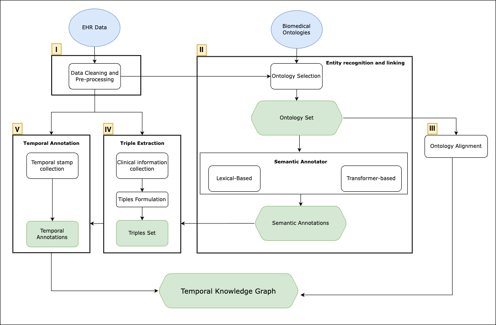

# Building a TKG for Electronic Health Records

In this method we propose a framework for constructing general edge-centric clinical TKGs. 
We employ lexical and transformer-based methods for semantic annotation, mapping EHR concepts to biomedical ontologies. These annotations are paired with temporal stamping,
enabling tracking of patient progression through time points and intervals for KG facts.
This work provides a comprehensive approach for creating TKGs from EHRs, setting the foundation
for general clinical TKG construction whilst allowing the extension to multiple clinical datasets, thereby
advancing further ML applications in healthcare.



This repository is split into four independet components, to be ran in the following order:

1. Ontology Selection
2. Ontology Alignment 
3. Semantic Annotation
4. Temporal Facts

## Ontology Selection

Aims to select the best ontology to cover the intended data set.
In this framework we are targeting intitial diagnostics information and use NCBO's recommender as a tool for the selection.

- Please acess the Ontology Selection directory to continue with the ontology selection
````
    cd OntologySelection
````

## Ontology Alignment 

With the alignment of ontologies, we are trying to provide additional connections between the different biomedical ontologies in use to enhance interoperability and
integration . The alignment will establishing correspondences between different ontology classes allowing a gate between the different ontologies to facilitate downstream tasks that establish paths in a KG.

- Please acess the Ontology Alignment directory to continue with the ontology alignment
````
    cd OntologyAlignment
````
